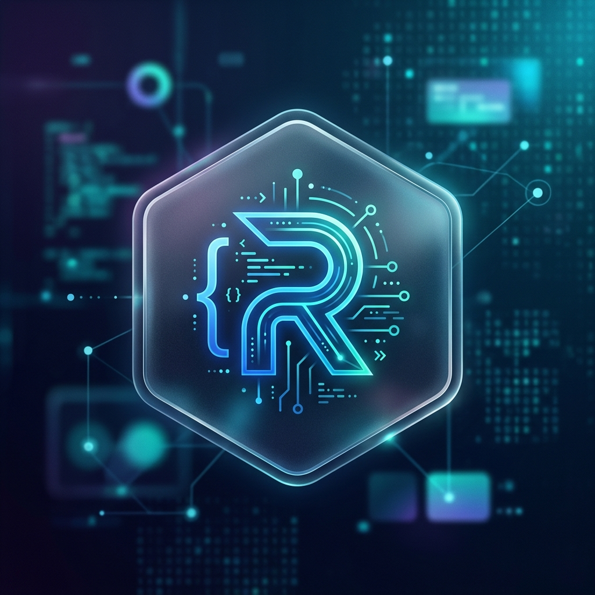

# 👨‍💻 Developer Identity: Rover Chen

## 🎯 About Me
I am a passionate developer focused on building innovative solutions at the intersection of hardware and software. I love "vibe coding" and exploring the potential of ESP32 and IoT devices.

## 🛠️ Technical Skills
- **Languages**: JavaScript (Next.js, Vite), C++ (Arduino/PlatformIO), Python
- **Hardware**: ESP32, BLE, IoT sensors
- **Tools**: GitHub, PlatformIO, Firebase

## 🌟 Featured Projects
- **[ESP32-C3 Launcher](https://github.com/roverchen/esp32c3-launcher)**: A robust firmware management system for ESP32-C3 devices.
- **Vibe Racer**: A web-controlled car with real-time BLE telemetry.

## 📬 Connect with Me
- [GitHub](https://github.com/roverchen)
- [LinkedIn](https://linkedin.com/in/roverchen)

---
> [!NOTE]
> I have completed the two-step verification (2FA) and saved my recovery codes.
